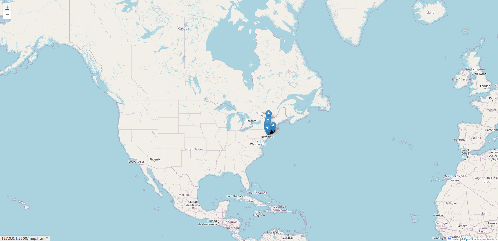
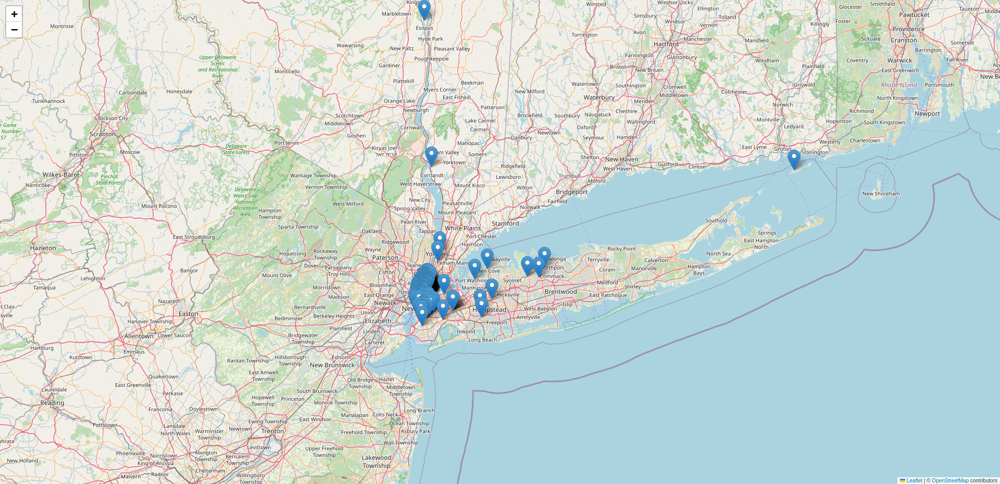

# Geocodificação de Endereços em Nova York

Este é um projeto de geocodificação de endereços em Nova York, utilizando uma base de dados obtida no Kaggle. O objetivo é converter endereços específicos de Nova York em coordenadas geográficas (latitude e longitude) e criar um mapa interativo para visualização.

## Funcionalidades

- Leitura de endereços a partir de um arquivo CSV.
- Geocodificação dos endereços utilizando a biblioteca Geopy.
- Processamento concorrente para otimizar o tempo de execução.
- Criação de um mapa interativo com marcadores para visualização dos endereços geocodificados.

## Instalação

1. Clone o repositório:

```
git clone https://github.com/elinefarias/geolocalizacao-de-cilentes-python.git
```

2. Instale as dependências:

```
pip install -r requirements.txt
```

## Utilização

1. Certifique-se de ter a base de dados de endereços em Nova York no formato CSV na pasta `data`.
2. Execute o script `main.py` para geocodificar os endereços e criar o mapa interativo.
3. O mapa resultante será salvo como `map.html` na pasta raiz do projeto.

## Demonstração

Aqui estão algumas imagens de demonstração do mapa criado:





